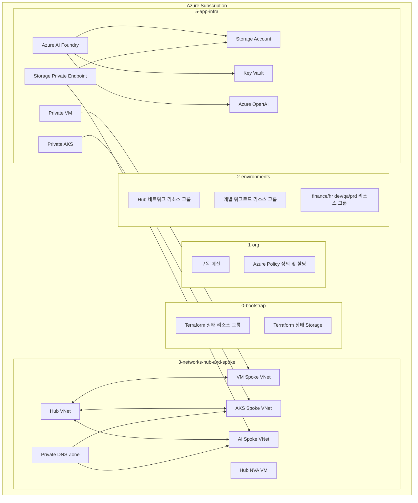

# Azure Landing Zone Test03  

이 저장소는 Terraform으로 Azure Landing Zone 실습 환경을 단계별로 배포하는 프로젝트입니다. Bootstrap 상태 저장소, 구독 수준 정책, 리소스 그룹, Hub-Spoke 네트워크, VM, Private AKS, Azure OpenAI, Azure AI Foundry, Storage, Key Vault, Private Endpoint를 순서대로 구성합니다.

이 문서는 실제 배포 순서대로 따라 할 수 있는 실행 가이드입니다.

## 구성 개요



## 단계별 디렉터리

| 단계 | 디렉터리 | 역할 |
|---|---|---|
| 0 | `0-bootstrap` | Terraform state용 리소스 그룹, Storage Account, Container 생성 |
| 1 | `1-org` | 구독 예산, Azure Policy 정의 및 할당 생성 |
| 2 | `2-environments` | 플랫폼, 워크로드, 부서별 리소스 그룹 생성 |
| 3 | `3-networks-hub-and-spoke` | Hub VNet, Spoke VNet, Subnet, Private DNS, Peering, NSG, Hub NVA 생성 |
| 4 | `4-projects` | 워크로드 프로젝트 카탈로그를 읽고 Terraform state에 기록 |
| 5 | `5-app-infra` | VM, Private AKS, Storage, Key Vault, Azure OpenAI, AI Foundry, Private Endpoint 생성 |

## 사전 준비

배포 서버에 다음 도구가 설치되어 있어야 합니다.

```bash
terraform version
az version
az login
az account show
```

검증에 사용한 권장 버전은 다음과 같습니다.

```text
Terraform v1.15.x
Azure CLI 2.86.x 이상
```

배포 계정에는 다음 권한이 필요합니다.

- 대상 구독의 `Owner` 또는 그에 준하는 권한
- Azure Policy 할당 생성 권한
- Storage data-plane 접근을 위한 Role Assignment 생성 권한
- AKS, VM, VNet, Storage, Key Vault, Cognitive Services, Machine Learning 리소스 생성 권한

## 저장소 받기

```bash
git clone https://github.com/sonmap/azure-landing-zone_test03.git
cd azure-landing-zone_test03
```

이미 서버에 배포용 폴더가 있다면 해당 경로로 이동합니다.

```bash
cd /home/son/azure_land03
```

## 설정 방식

이 프로젝트는 CSV 기반으로 동작합니다. 실제 배포 값은 대부분 각 단계의 `csv/*.csv` 파일에서 읽습니다. `terraform.tfvars`만 수정한다고 전체 배포 값이 바뀌는 구조가 아닙니다.

중요한 설정 파일은 다음과 같습니다.

```text
1-org/csv/org_config.csv
1-org/csv/policy_assignments.csv
2-environments/csv/*.csv
3-networks-hub-and-spoke/csv/network_config.csv
3-networks-hub-and-spoke/csv/networks.csv
3-networks-hub-and-spoke/csv/subnets.csv
3-networks-hub-and-spoke/csv/routes.csv
5-app-infra/csv/app_config.csv
5-app-infra/csv/aks_clusters.csv
5-app-infra/csv/ai_services.csv
5-app-infra/csv/vm_workloads.csv
```

배포 전에 현재 Azure 구독을 확인합니다.

```bash
az account show --query "{subscription:id, tenant:tenantId, user:user.name}" -o table
```

그 다음 CSV 파일의 구독 ID 값을 본인의 구독 ID로 바꿉니다. 하나의 구독에서 실습한다면 `platform_subscription_id`와 `dev_subscription_id`를 같은 값으로 사용할 수 있습니다.

예시:

```csv
platform_subscription_id,dev_subscription_id,prefix
<SUBSCRIPTION_ID>,<SUBSCRIPTION_ID>,land03
```

## 중요한 실습 설정

### AKS outbound

빠른 실습 배포에서는 AKS outbound를 `loadBalancer`로 두는 것이 단순합니다.

```csv
# 5-app-infra/csv/aks_clusters.csv
outbound_type
loadBalancer
```

`outbound_type=userDefinedRouting`을 사용할 경우 Hub NVA가 NAT/egress를 제공해야 합니다. 그렇지 않으면 AKS 노드 생성이 실패할 수 있습니다.

```text
VMExtensionError_OutboundConnFail
```

### Public IP 정책

AKS가 `loadBalancer` outbound를 사용하면 AKS 관리 리소스 그룹에 Public IP가 생성될 수 있습니다. Public IP 차단 정책이 켜져 있으면 AKS 생성이 막힐 수 있습니다.

실습에서는 다음 값을 `false`로 둡니다.

```csv
# 1-org/csv/policy_assignments.csv
key,name,create
deny_public_ip_in_dev,land03-deny-public-ip-dev,false
```

비싼 네트워크 리소스를 제한하는 정책은 필요하면 유지할 수 있습니다.

```csv
deny_expensive_network,land03-deny-expensive-network-lab,true
```

### AKS Route Table

AKS outbound를 `loadBalancer`로 사용할 때는 AKS subnet에 NVA 기본 경로를 붙이지 않는 것이 안전합니다.

```csv
# 3-networks-hub-and-spoke/csv/routes.csv
key,create
spoke_aks_default_to_hub_nva,false
```

### Storage data-plane 권한

Terraform이 Storage Blob 또는 Queue 속성을 읽어야 할 수 있습니다. Storage 403 오류가 발생하면 현재 배포 사용자에게 Storage Account scope에서 다음 역할을 부여합니다.

```bash
STORAGE_ID="/subscriptions/<subscription-id>/resourceGroups/rg-land03-dev-workloads/providers/Microsoft.Storage/storageAccounts/<storage-account-name>"
ASSIGNEE_OBJECT_ID=$(az ad signed-in-user show --query id -o tsv)

az role assignment create \
  --assignee "$ASSIGNEE_OBJECT_ID" \
  --role "Storage Blob Data Owner" \
  --scope "$STORAGE_ID"

az role assignment create \
  --assignee "$ASSIGNEE_OBJECT_ID" \
  --role "Storage Queue Data Contributor" \
  --scope "$STORAGE_ID"
```

필요하면 Terraform 실행 시 Azure AD Storage 인증을 사용합니다.

```bash
ARM_STORAGE_USE_AZUREAD=true terraform plan
ARM_STORAGE_USE_AZUREAD=true terraform apply
```

## 전체 검증

배포 전에 모든 단계에서 `init`과 `validate`를 실행합니다.

```bash
for d in \
  0-bootstrap \
  1-org \
  2-environments \
  3-networks-hub-and-spoke \
  4-projects \
  5-app-infra; do
  echo "### $d"
  terraform -chdir="$d" init -input=false
  terraform -chdir="$d" validate
done
```

`terraform.tfvars`에 선언되지 않은 변수가 있다는 경고가 나올 수 있습니다. 이 프로젝트는 CSV 중심으로 값을 읽기 때문에 모든 경고가 배포 차단 사유는 아니지만, 내용은 확인해야 합니다.

## 배포 순서

반드시 단계 순서대로 실행합니다.

### 0-bootstrap

```bash
cd 0-bootstrap
terraform init
terraform plan -out=tfplan
terraform apply tfplan
cd ..
```

생성되는 대표 리소스:

```text
rg-land03-tfstate
Terraform state용 Storage Account
Terraform state용 Container
```

### 1-org

```bash
cd 1-org
terraform init
terraform plan -out=tfplan
terraform apply tfplan
cd ..
```

생성되는 대표 리소스:

```text
Subscription Budget
Azure Policy Definition
Azure Policy Assignment
```

AKS 실습 배포에서는 Public IP 차단 정책을 비활성화한 뒤 적용합니다.

### 2-environments

```bash
cd 2-environments
terraform init
terraform plan -out=tfplan
terraform apply tfplan
cd ..
```

생성되는 대표 리소스 그룹:

```text
rg-land03-hub-network
rg-land03-dev-workloads
rg-land03-finance-dev
rg-land03-finance-qa
rg-land03-finance-prd
rg-land03-hr-dev
rg-land03-hr-qa
rg-land03-hr-prd
```

### 3-networks-hub-and-spoke

```bash
cd 3-networks-hub-and-spoke
terraform init
terraform plan -out=tfplan
terraform apply tfplan
cd ..
```

생성되는 대표 리소스:

```text
Hub VNet
Spoke VNet 3개
Subnet
VNet Peering
Private DNS Zone
Hub NVA VM
Hub NVA NIC 및 NSG
```

AKS 실습 배포에서는 NVA에 NAT/egress를 구성하지 않았다면 AKS subnet 기본 경로를 비활성화합니다.

### 4-projects

```bash
cd 4-projects
terraform init
terraform plan -out=tfplan
terraform apply tfplan
cd ..
```

이 단계는 Azure 리소스를 직접 만들지 않을 수 있습니다. 프로젝트 카탈로그 정보를 Terraform state에 기록하는 용도입니다.

### 5-app-infra

```bash
cd 5-app-infra
terraform init
terraform plan -out=tfplan
terraform apply tfplan
cd ..
```

생성되는 대표 리소스:

```text
vm-land03-dev-001
aks-land03-dev-001
stland03<suffix>
kv-land03-<suffix>
aoai-land03-<suffix>
aif-land03-<suffix>
pe-land03-ai-storage-blob
```

Storage data-plane 403 오류가 발생하면 앞의 Storage 권한 설정을 적용한 뒤 다시 실행합니다.

## 문제 발생 시 복구 순서

### 현재 Azure 리소스 확인

```bash
az group list -o table | grep land03 || true
az resource list -o table | grep land03 || true
```

### 네트워크 단계 복구

```bash
terraform -chdir=3-networks-hub-and-spoke plan -out=tfplan
terraform -chdir=3-networks-hub-and-spoke apply -auto-approve tfplan
```

### 실패한 AKS 삭제 후 재시도

```bash
az aks delete \
  -g rg-land03-dev-workloads \
  -n aks-land03-dev-001 \
  --yes \
  --no-wait
```

삭제 상태 확인:

```bash
az aks show \
  -g rg-land03-dev-workloads \
  -n aks-land03-dev-001 \
  --query "{provisioningState:provisioningState,powerState:powerState.code}" \
  -o table
```

`NotFound`가 나오면 Terraform apply를 다시 실행합니다.

### 필요한 경우 AKS만 target 적용

`-target`은 일반 배포 방식이 아니라 복구 용도로만 사용합니다.

```bash
terraform -chdir=5-app-infra plan \
  -target='azurerm_kubernetes_cluster.aks["dev"]' \
  -out=tfplan-aks

terraform -chdir=5-app-infra apply -auto-approve tfplan-aks
```

### Storage refresh가 막을 때 AI Foundry와 Private Endpoint만 복구

```bash
ARM_STORAGE_USE_AZUREAD=true terraform -chdir=5-app-infra plan \
  -refresh=false \
  -target='azurerm_ai_foundry.hub["ai"]' \
  -target='azurerm_private_endpoint.ai_storage_blob["ai"]' \
  -out=tfplan-ai

ARM_STORAGE_USE_AZUREAD=true terraform -chdir=5-app-infra apply -auto-approve tfplan-ai
```

## 배포 후 확인

### 리소스 그룹 확인

```bash
az group list -o table | grep land03
```

예상 리소스 그룹:

```text
rg-land03-tfstate
rg-land03-hub-network
rg-land03-dev-workloads
rg-land03-finance-dev
rg-land03-finance-qa
rg-land03-finance-prd
rg-land03-hr-dev
rg-land03-hr-qa
rg-land03-hr-prd
MC_rg-land03-dev-workloads_aks-land03-dev-001_koreacentral
```

### 전체 리소스 확인

```bash
az resource list -o table | grep land03
```

### AKS 상태 확인

```bash
az aks show \
  -g rg-land03-dev-workloads \
  -n aks-land03-dev-001 \
  --query "{provisioningState:provisioningState,powerState:powerState.code,kubernetesVersion:kubernetesVersion,privateFqdn:privateFqdn}" \
  -o table
```

정상 상태:

```text
ProvisioningState: Succeeded
PowerState: Running
```

### Terraform state 확인

```bash
terraform -chdir=5-app-infra state list
```

대표적으로 다음 리소스가 보여야 합니다.

```text
azurerm_ai_foundry.hub["ai"]
azurerm_cognitive_account.openai["ai"]
azurerm_key_vault.ai["ai"]
azurerm_kubernetes_cluster.aks["dev"]
azurerm_linux_virtual_machine.vm["vm1"]
azurerm_network_interface.vm["vm1"]
azurerm_private_endpoint.ai_storage_blob["ai"]
azurerm_storage_account.ai["ai"]
random_string.suffix
```

## 접속 참고

AKS 클러스터는 private cluster입니다. API 서버는 private endpoint에 접근 가능한 네트워크에서만 연결됩니다.

자격 증명 가져오기:

```bash
az aks get-credentials \
  -g rg-land03-dev-workloads \
  -n aks-land03-dev-001 \
  --overwrite-existing
```

VNet 외부에서 실행하면 private API server에 연결되지 않을 수 있습니다.

워크로드 VM도 기본적으로 Public IP가 없습니다. 접속하려면 Jump Host, VPN, Bastion 대안, 또는 별도 private network 경로가 필요합니다.

## 비용 참고

이 실습은 비용이 발생하는 리소스를 생성합니다.

```text
Virtual Machine
Managed Disk
AKS Node VMSS
Load Balancer 및 AKS 관리 리소스 그룹의 Public IP
Storage Account
Key Vault 작업 비용
Azure OpenAI 사용량
AI Foundry 관련 리소스
Private Endpoint
```

비용 확인:

```bash
az consumption budget list -o table
az resource list -o table | grep land03
```

## 삭제 순서

삭제는 배포의 역순으로 진행합니다.

```bash
terraform -chdir=5-app-infra destroy
terraform -chdir=4-projects destroy
terraform -chdir=3-networks-hub-and-spoke destroy
terraform -chdir=2-environments destroy
terraform -chdir=1-org destroy
terraform -chdir=0-bootstrap destroy
```

리소스 그룹 안에 다른 중요한 리소스가 없다는 것을 확실히 확인한 경우에는 빠르게 리소스 그룹 단위로 삭제할 수도 있습니다.

```bash
az group delete -n rg-land03-dev-workloads --yes --no-wait
az group delete -n rg-land03-hub-network --yes --no-wait
az group delete -n rg-land03-tfstate --yes --no-wait
```

AKS 관리 리소스 그룹이 남았는지도 확인합니다.

```bash
az group list -o table | grep MC_rg-land03
```

남아 있다면 삭제합니다.

```bash
az group delete \
  -n MC_rg-land03-dev-workloads_aks-land03-dev-001_koreacentral \
  --yes \
  --no-wait
```

## 자주 발생한 오류

### AKS outbound 실패

증상:

```text
VMExtensionError_OutboundConnFail
AKS Node provisioning failed due to inability to establish outbound connectivity
```

원인:

```text
AKS outbound_type=userDefinedRouting 이지만 next hop NVA가 NAT/egress를 제공하지 않음
```

실습용 해결:

```text
AKS outbound_type=loadBalancer 설정
AKS default route to NVA 비활성화
Public IP deny policy assignment 비활성화
```

### 정책 때문에 AKS 생성 실패

증상:

```text
RequestDisallowedByPolicy
Deny Public IP in Dev Spokes
```

해결:

```text
1-org/csv/policy_assignments.csv에서 deny_public_ip_in_dev create=false 설정
1-org 단계 terraform plan/apply 실행
AKS 생성 재시도
```

### Terraform plan/apply 중 Storage 403

증상:

```text
retrieving queue properties for Storage Account
unexpected status 403
AuthenticationFailed
```

해결:

```text
배포 사용자에게 Storage Blob Data Owner와 Storage Queue Data Contributor 부여
ARM_STORAGE_USE_AZUREAD=true 사용
필요하면 AI Foundry와 Private Endpoint target 복구 실행
```

### 수동 삭제 후 Terraform state 불일치

증상:

```text
Terraform state에는 리소스가 있지만 az resource list에는 보이지 않음
```

해결:

```bash
terraform -chdir=<stage> plan -out=tfplan
terraform -chdir=<stage> apply tfplan
```

Terraform이 state를 refresh하고 누락된 리소스를 다시 생성합니다.

## 운영 가이드

- CSV 파일을 source of truth로 관리합니다.
- Azure Portal에서 수동 변경한 내용은 반드시 CSV/Terraform에 반영합니다.
- 매번 `terraform apply` 전에 `terraform plan`을 확인합니다.
- `-target`은 일반 배포가 아니라 장애 복구용으로만 사용합니다.
- VM과 AKS는 실행 중 비용이 발생하므로 비용을 계속 확인합니다.
- 실습용 비밀번호나 secret은 실제 운영 환경에서 사용하지 말고 반드시 교체합니다.

## 보안 주의

GitHub에는 다음 파일을 올리지 마십시오.

```text
.terraform/
*.tfstate
*.tfstate.*
tfplan*
*.tfvars
terraform.tfvars*
*.csv.bak.*
*.pem
*.key
*.pfx
*.p12
*.env
```

공개 저장소에서는 실제 Subscription ID, Tenant ID, Object ID, 이메일, 비밀번호를 직접 넣지 말고 placeholder를 사용하십시오.

```text
<SUBSCRIPTION_ID>
<DEV_SUBSCRIPTION_ID>
owner@example.com
REPLACE_WITH_SECURE_PASSWORD
<ADMIN_PUBLIC_IP>/32
```
