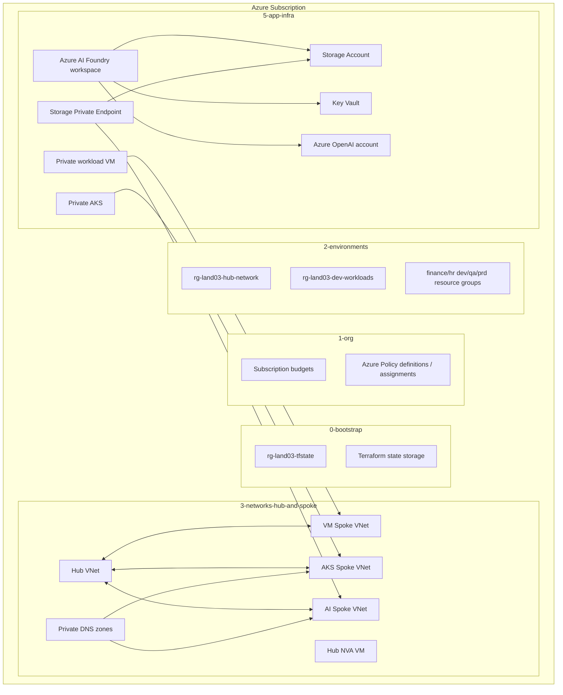

# Azure Landing Zone Test03

Korean guide: [README.ko.md](README.ko.md)


Azure Landing Zone Test03 is a Terraform-based Azure lab foundation. It creates a staged landing-zone model with bootstrap state resources, subscription-level guardrails, environment resource groups, hub-and-spoke networking, workload boundaries, and application infrastructure such as VM, private AKS, Azure OpenAI, Azure AI Foundry, Storage, Key Vault, and Private Endpoint.

This README is written as a deployment runbook. Follow the stages in order.

## Architecture Summary



## Stage Layout

| Stage | Directory | Purpose |
|---|---|---|
| 0 | `0-bootstrap` | Creates Terraform state resource group, storage account, and container. |
| 1 | `1-org` | Creates subscription budgets and Azure Policy definitions/assignments. |
| 2 | `2-environments` | Creates platform/workload/department resource groups. |
| 3 | `3-networks-hub-and-spoke` | Creates hub VNet, spoke VNets, subnets, private DNS zones, peering, NSG, and hub NVA VM. |
| 4 | `4-projects` | Reads workload project catalog and records workload outputs/state. |
| 5 | `5-app-infra` | Creates workload VM, private AKS, Storage, Key Vault, Azure OpenAI, AI Foundry, and Private Endpoint. |

## Prerequisites

Install and authenticate these tools on the deployment host.

```bash
terraform version
az version
az login
az account show
```

Recommended versions used during validation:

```text
Terraform v1.15.x
Azure CLI 2.86.x or later
```

The deployment account needs enough permission to create resources at subscription and resource group scopes:

- `Owner` or equivalent on the target subscription for resource creation.
- Permission to create Azure Policy assignments.
- Permission to create role assignments when Storage data-plane access is needed.
- Permission to create AKS, VM, VNet, Storage, Key Vault, Cognitive Services, and Machine Learning resources.

## Clone

```bash
git clone https://github.com/sonmap/azure-landing-zone_test03.git
cd azure-landing-zone_test03
```

If you are using the tested server path:

```bash
cd /home/son/azure_land03
```

## Configuration Model

This project is CSV-driven. The active deployment values are primarily read from each stage's `csv/*.csv` files, not only from `terraform.tfvars`.

Important files:

```text
1-org/csv/org_config.csv
1-org/csv/policy_assignments.csv
2-environments/csv/*.csv
3-networks-hub-and-spoke/csv/network_config.csv
3-networks-hub-and-spoke/csv/networks.csv
3-networks-hub-and-spoke/csv/subnets.csv
3-networks-hub-and-spoke/csv/routes.csv
5-app-infra/csv/app_config.csv
5-app-infra/csv/aks_clusters.csv
5-app-infra/csv/ai_services.csv
5-app-infra/csv/vm_workloads.csv
```

Before deployment, check subscription IDs:

```bash
az account show --query "{subscription:id, tenant:tenantId, user:user.name}" -o table
```

Then make sure CSV config files use the correct subscription ID. For a single-subscription lab, both platform and dev subscription values can point to the same subscription.

Example:

```csv
platform_subscription_id,dev_subscription_id,prefix
<SUBSCRIPTION_ID>,<SUBSCRIPTION_ID>,land03
```

## Important Lab Settings

The tested lab deployment required these settings.

### AKS outbound

For a quick lab deployment, use AKS `loadBalancer` outbound:

```csv
# 5-app-infra/csv/aks_clusters.csv
outbound_type
loadBalancer
```

If `outbound_type=userDefinedRouting`, the hub NVA must provide working NAT/egress. Without that, AKS node provisioning can fail with:

```text
VMExtensionError_OutboundConnFail
```

### Public IP policy

If AKS uses `loadBalancer` outbound, Azure will create a public IP in the AKS managed resource group. A deny-public-IP policy assignment can block AKS creation.

For this lab, set the public IP deny assignment to `false`:

```csv
# 1-org/csv/policy_assignments.csv
key,name,create
deny_public_ip_in_dev,land03-deny-public-ip-dev,false
```

Keep the expensive network deny policy enabled if desired:

```csv
deny_expensive_network,land03-deny-expensive-network-lab,true
```

### AKS route table

If using AKS `loadBalancer` outbound, do not attach the default route-to-NVA route table to the AKS subnet:

```csv
# 3-networks-hub-and-spoke/csv/routes.csv
key,create
spoke_aks_default_to_hub_nva,false
```

### Storage data-plane access

Terraform may need to read Storage Blob/Queue data-plane properties. If you see Storage 403 errors, assign these roles to the current deployment user at Storage Account scope:

```bash
STORAGE_ID="/subscriptions/<subscription-id>/resourceGroups/rg-land03-dev-workloads/providers/Microsoft.Storage/storageAccounts/<storage-account-name>"
ASSIGNEE_OBJECT_ID=$(az ad signed-in-user show --query id -o tsv)

az role assignment create \
  --assignee "$ASSIGNEE_OBJECT_ID" \
  --role "Storage Blob Data Owner" \
  --scope "$STORAGE_ID"

az role assignment create \
  --assignee "$ASSIGNEE_OBJECT_ID" \
  --role "Storage Queue Data Contributor" \
  --scope "$STORAGE_ID"
```

Run Terraform with Azure AD Storage authentication if required:

```bash
ARM_STORAGE_USE_AZUREAD=true terraform plan
ARM_STORAGE_USE_AZUREAD=true terraform apply
```

## Validate All Stages

Run validation before deployment:

```bash
for d in \
  0-bootstrap \
  1-org \
  2-environments \
  3-networks-hub-and-spoke \
  4-projects \
  5-app-infra; do
  echo "### $d"
  terraform -chdir="$d" init -input=false
  terraform -chdir="$d" validate
done
```

Warnings about undeclared variables can appear when `terraform.tfvars` contains values not used by the active CSV-driven module. Review them, but they are not always blockers.

## Deployment Steps

Run stages in order.

### 0-bootstrap

```bash
cd 0-bootstrap
terraform init
terraform plan -out=tfplan
terraform apply tfplan
cd ..
```

Creates Terraform state infrastructure.

Typical resources:

```text
rg-land03-tfstate
storage account for tfstate
storage container for tfstate
```

### 1-org

```bash
cd 1-org
terraform init
terraform plan -out=tfplan
terraform apply tfplan
cd ..
```

Creates:

```text
Subscription budgets
Azure Policy definitions
Azure Policy assignments
```

For the lab AKS deployment, disable the public IP deny assignment as described above before applying this stage.

### 2-environments

```bash
cd 2-environments
terraform init
terraform plan -out=tfplan
terraform apply tfplan
cd ..
```

Creates resource groups such as:

```text
rg-land03-hub-network
rg-land03-dev-workloads
rg-land03-finance-dev
rg-land03-finance-qa
rg-land03-finance-prd
rg-land03-hr-dev
rg-land03-hr-qa
rg-land03-hr-prd
```

### 3-networks-hub-and-spoke

```bash
cd 3-networks-hub-and-spoke
terraform init
terraform plan -out=tfplan
terraform apply tfplan
cd ..
```

Creates:

```text
Hub VNet
Three spoke VNets
Subnets
VNet peerings
Private DNS zones
Hub NVA VM
Hub NVA NIC and NSG
```

For the lab AKS deployment, keep the AKS subnet default route disabled unless the NVA is configured for NAT/egress.

### 4-projects

```bash
cd 4-projects
terraform init
terraform plan -out=tfplan
terraform apply tfplan
cd ..
```

This stage may not create Azure resources. It records workload project catalog outputs in Terraform state.

### 5-app-infra

```bash
cd 5-app-infra
terraform init
terraform plan -out=tfplan
terraform apply tfplan
cd ..
```

Creates:

```text
vm-land03-dev-001
aks-land03-dev-001
stland03<suffix>
kv-land03-<suffix>
aoai-land03-<suffix>
aif-land03-<suffix>
pe-land03-ai-storage-blob
```

If Storage data-plane 403 errors occur, apply the Storage RBAC workaround from the Storage section and rerun.

## Tested Recovery Flow

If an earlier run left partial state or failed AKS provisioning, use this recovery sequence.

### Check current Azure resources

```bash
az group list -o table | grep land03 || true
az resource list -o table | grep land03 || true
```

### Refresh and recover networks

```bash
terraform -chdir=3-networks-hub-and-spoke plan -out=tfplan
terraform -chdir=3-networks-hub-and-spoke apply -auto-approve tfplan
```

### Remove failed AKS before retry

```bash
az aks delete \
  -g rg-land03-dev-workloads \
  -n aks-land03-dev-001 \
  --yes \
  --no-wait
```

Check deletion:

```bash
az aks show \
  -g rg-land03-dev-workloads \
  -n aks-land03-dev-001 \
  --query "{provisioningState:provisioningState,powerState:powerState.code}" \
  -o table
```

If the AKS CLI reports `NotFound`, retry Terraform apply.

### Target AKS only if needed

Use target only for recovery, not as the default workflow:

```bash
terraform -chdir=5-app-infra plan \
  -target='azurerm_kubernetes_cluster.aks["dev"]' \
  -out=tfplan-aks

terraform -chdir=5-app-infra apply -auto-approve tfplan-aks
```

### Target AI Foundry and Private Endpoint if Storage refresh blocks full plan

```bash
ARM_STORAGE_USE_AZUREAD=true terraform -chdir=5-app-infra plan \
  -refresh=false \
  -target='azurerm_ai_foundry.hub["ai"]' \
  -target='azurerm_private_endpoint.ai_storage_blob["ai"]' \
  -out=tfplan-ai

ARM_STORAGE_USE_AZUREAD=true terraform -chdir=5-app-infra apply -auto-approve tfplan-ai
```

## Post-Deployment Verification

### Resource groups

```bash
az group list -o table | grep land03
```

Expected groups include:

```text
rg-land03-tfstate
rg-land03-hub-network
rg-land03-dev-workloads
rg-land03-finance-dev
rg-land03-finance-qa
rg-land03-finance-prd
rg-land03-hr-dev
rg-land03-hr-qa
rg-land03-hr-prd
MC_rg-land03-dev-workloads_aks-land03-dev-001_koreacentral
```

### All land03 resources

```bash
az resource list -o table | grep land03
```

### AKS status

```bash
az aks show \
  -g rg-land03-dev-workloads \
  -n aks-land03-dev-001 \
  --query "{provisioningState:provisioningState,powerState:powerState.code,kubernetesVersion:kubernetesVersion,privateFqdn:privateFqdn}" \
  -o table
```

Expected:

```text
ProvisioningState: Succeeded
PowerState: Running
```

### Terraform state

```bash
terraform -chdir=5-app-infra state list
```

Expected resources include:

```text
azurerm_ai_foundry.hub["ai"]
azurerm_cognitive_account.openai["ai"]
azurerm_key_vault.ai["ai"]
azurerm_kubernetes_cluster.aks["dev"]
azurerm_linux_virtual_machine.vm["vm1"]
azurerm_network_interface.vm["vm1"]
azurerm_private_endpoint.ai_storage_blob["ai"]
azurerm_storage_account.ai["ai"]
random_string.suffix
```

## Access Notes

The AKS cluster is private. Its API endpoint is reachable only from a network path that can resolve and reach the private endpoint.

To get credentials:

```bash
az aks get-credentials \
  -g rg-land03-dev-workloads \
  -n aks-land03-dev-001 \
  --overwrite-existing
```

If running from outside the VNet, `kubectl` may not connect because the API server is private.

The workload VM is private and does not have a public IP by default. Access requires a private network path, jump host, VPN, Bastion alternative, or temporary controlled access design.

## Cost Notes

This lab creates billable resources, including:

```text
Virtual machines
Managed disks
AKS node VMSS
Load balancer and public IP in the AKS managed resource group
Storage account
Key Vault operations
Azure OpenAI account usage
AI Foundry workspace-related resources
Private endpoints
```

Review cost after deployment:

```bash
az consumption budget list -o table
az resource list -o table | grep land03
```

## Destroy Order

Destroy in reverse order.

```bash
terraform -chdir=5-app-infra destroy
terraform -chdir=4-projects destroy
terraform -chdir=3-networks-hub-and-spoke destroy
terraform -chdir=2-environments destroy
terraform -chdir=1-org destroy
terraform -chdir=0-bootstrap destroy
```

If you need to remove everything quickly and are sure no other resources are inside the groups, delete resource groups:

```bash
az group delete -n rg-land03-dev-workloads --yes --no-wait
az group delete -n rg-land03-hub-network --yes --no-wait
az group delete -n rg-land03-tfstate --yes --no-wait
```

Also check for the AKS managed resource group:

```bash
az group list -o table | grep MC_rg-land03
```

Then delete it if it remains:

```bash
az group delete \
  -n MC_rg-land03-dev-workloads_aks-land03-dev-001_koreacentral \
  --yes \
  --no-wait
```

## Troubleshooting

### AKS outbound failure

Symptom:

```text
VMExtensionError_OutboundConnFail
AKS Node provisioning failed due to inability to establish outbound connectivity
```

Cause:

```text
AKS outbound_type=userDefinedRouting, but the next hop NVA does not provide NAT/egress.
```

Fix for lab:

```text
Set AKS outbound_type=loadBalancer.
Disable AKS default route to NVA.
Disable public IP deny policy assignment.
```

### AKS blocked by policy

Symptom:

```text
RequestDisallowedByPolicy
Deny Public IP in Dev Spokes
```

Fix:

```text
Set deny_public_ip_in_dev create=false in 1-org/csv/policy_assignments.csv.
Run terraform plan/apply in 1-org.
Retry AKS creation.
```

### Storage 403 during Terraform plan/apply

Symptom:

```text
retrieving queue properties for Storage Account
unexpected status 403
AuthenticationFailed
```

Fix:

```text
Grant Storage Blob Data Owner and Storage Queue Data Contributor to the deployment user.
Use ARM_STORAGE_USE_AZUREAD=true.
If necessary, use targeted recovery for AI Foundry and Private Endpoint.
```

### Stale Terraform state after manual deletion

Symptom:

```text
Terraform state lists resources, but az resource list does not show them.
```

Fix:

```bash
terraform -chdir=<stage> plan -out=tfplan
terraform -chdir=<stage> apply tfplan
```

Terraform will refresh state and recreate missing resources.

## Current Tested Output Example

A successful deployment produced resources similar to these:

```text
rg-land03-hub-network
  vnet-land03-hub-krc-001
  vm-land03-hub-nva-001
  nsg-land03-hub-nva
  private DNS zones

rg-land03-dev-workloads
  vnet-land03-spoke-dev-001
  vnet-land03-spoke-dev-002
  vnet-land03-spoke-ai-dev-001
  vm-land03-dev-001
  aks-land03-dev-001
  stland03o6hfyb
  kv-land03-o6hfyb
  aoai-land03-o6hfyb
  aif-land03-o6hfyb
  pe-land03-ai-storage-blob

MC_rg-land03-dev-workloads_aks-land03-dev-001_koreacentral
  AKS load balancer
  AKS public IP
  AKS VMSS
  AKS private API endpoint
  AKS private DNS zone
```

## Operational Guidance

- Treat CSV files as the source of truth.
- Avoid manual Azure Portal changes unless you record them back into CSV/Terraform.
- Use `terraform plan` before every apply.
- Use `-target` only for recovery from partial failures.
- Keep cost visibility active because VM and AKS resources are billable while running.
- Rotate any lab passwords or secrets before production-style use.
