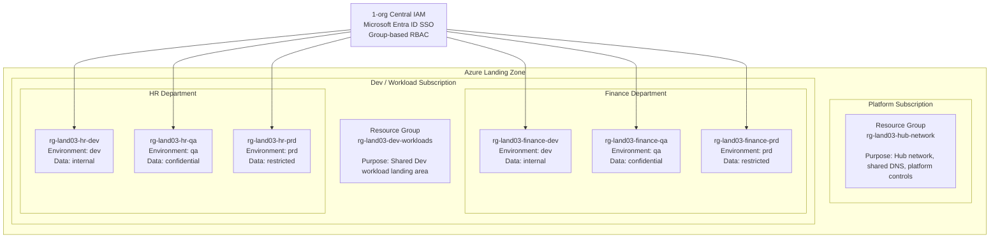
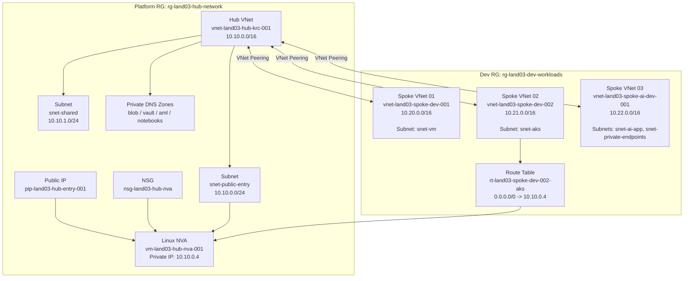
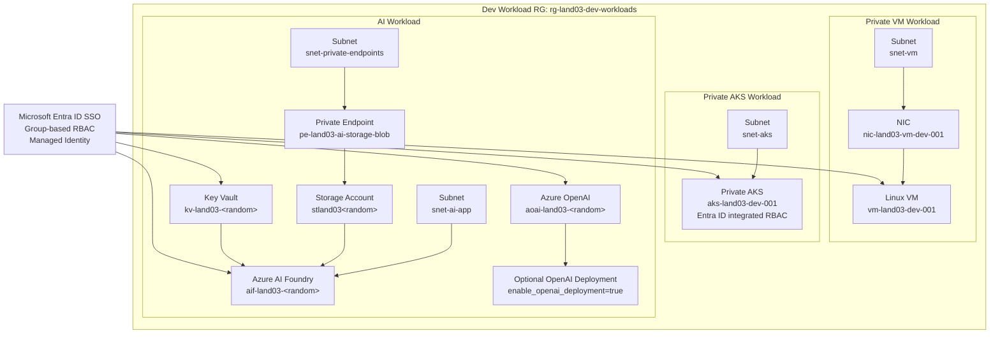
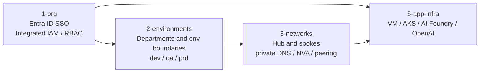

# Environment, Network, and App Infrastructure Box Diagram

## 2-environments

```mermaid
flowchart TB
  subgraph AZ["Azure Landing Zone"]
    subgraph PLATFORM["Platform Subscription"]
      RG_HUB["Resource Group<br/>rg-land03-hub-network<br/><br/>Purpose: Hub network, shared DNS, platform controls"]
    end

    subgraph DEV_SUB["Dev / Workload Subscription"]
      RG_DEV["Resource Group<br/>rg-land03-dev-workloads<br/><br/>Purpose: Shared Dev workload landing area"]

      subgraph FIN["Finance Department"]
        FIN_DEV["rg-land03-finance-dev<br/>Environment: dev<br/>Data: internal"]
        FIN_QA["rg-land03-finance-qa<br/>Environment: qa<br/>Data: confidential"]
        FIN_PRD["rg-land03-finance-prd<br/>Environment: prd<br/>Data: restricted"]
      end

      subgraph HR["HR Department"]
        HR_DEV["rg-land03-hr-dev<br/>Environment: dev<br/>Data: internal"]
        HR_QA["rg-land03-hr-qa<br/>Environment: qa<br/>Data: confidential"]
        HR_PRD["rg-land03-hr-prd<br/>Environment: prd<br/>Data: restricted"]
      end
    end
  end

  IAM["1-org Central IAM<br/>Microsoft Entra ID SSO<br/>Group-based RBAC"] --> FIN_DEV
  IAM --> FIN_QA
  IAM --> FIN_PRD
  IAM --> HR_DEV
  IAM --> HR_QA
  IAM --> HR_PRD
```

## 3-networks-hub-and-spoke

```mermaid
flowchart TB
  subgraph HUB_RG["Platform RG: rg-land03-hub-network"]
    HUB_VNET["Hub VNet<br/>vnet-land03-hub-krc-001<br/>10.10.0.0/16"]
    HUB_PUBLIC["Subnet<br/>snet-public-entry<br/>10.10.0.0/24"]
    HUB_SHARED["Subnet<br/>snet-shared<br/>10.10.1.0/24"]
    NVA["Linux NVA<br/>vm-land03-hub-nva-001<br/>Private IP: 10.10.0.4"]
    PIP["Public IP<br/>pip-land03-hub-entry-001"]
    NSG["NSG<br/>nsg-land03-hub-nva"]
    DNS["Private DNS Zones<br/>blob / vault / aml / notebooks"]
  end

  subgraph DEV_RG["Dev RG: rg-land03-dev-workloads"]
    SPOKE_VM["Spoke VNet 01<br/>vnet-land03-spoke-dev-001<br/>10.20.0.0/16<br/><br/>Subnet: snet-vm"]
    SPOKE_AKS["Spoke VNet 02<br/>vnet-land03-spoke-dev-002<br/>10.21.0.0/16<br/><br/>Subnet: snet-aks"]
    SPOKE_AI["Spoke VNet 03<br/>vnet-land03-spoke-ai-dev-001<br/>10.22.0.0/16<br/><br/>Subnets: snet-ai-app, snet-private-endpoints"]
    RT_AKS["Route Table<br/>rt-land03-spoke-dev-002-aks<br/>0.0.0.0/0 -> 10.10.0.4"]
  end

  PIP --> NVA
  NSG --> NVA
  HUB_PUBLIC --> NVA
  HUB_VNET --> HUB_PUBLIC
  HUB_VNET --> HUB_SHARED
  HUB_VNET --> DNS

  HUB_VNET <-->|VNet Peering| SPOKE_VM
  HUB_VNET <-->|VNet Peering| SPOKE_AKS
  HUB_VNET <-->|VNet Peering| SPOKE_AI
  SPOKE_AKS --> RT_AKS --> NVA
```

## 5-app-infra

```mermaid
flowchart TB
  SSO["Microsoft Entra ID SSO<br/>Group-based RBAC<br/>Managed Identity"]

  subgraph DEV_RG["Dev Workload RG: rg-land03-dev-workloads"]
    subgraph VM_BOX["Private VM Workload"]
      VM_SUBNET["Subnet<br/>snet-vm"]
      VM_NIC["NIC<br/>nic-land03-vm-dev-001"]
      VM["Linux VM<br/>vm-land03-dev-001"]
    end

    subgraph AKS_BOX["Private AKS Workload"]
      AKS_SUBNET["Subnet<br/>snet-aks"]
      AKS["Private AKS<br/>aks-land03-dev-001<br/>Entra ID integrated RBAC"]
    end

    subgraph AI_BOX["AI Workload"]
      AI_APP_SUBNET["Subnet<br/>snet-ai-app"]
      PE_SUBNET["Subnet<br/>snet-private-endpoints"]
      STORAGE["Storage Account<br/>stland03&lt;random&gt;"]
      KV["Key Vault<br/>kv-land03-&lt;random&gt;"]
      AIF["Azure AI Foundry<br/>aif-land03-&lt;random&gt;"]
      PE["Private Endpoint<br/>pe-land03-ai-storage-blob"]
      AOAI["Azure OpenAI<br/>aoai-land03-&lt;random&gt;"]
      DEPLOY["Optional OpenAI Deployment<br/>enable_openai_deployment=true"]
    end
  end

  VM_SUBNET --> VM_NIC --> VM
  AKS_SUBNET --> AKS
  AI_APP_SUBNET --> AIF
  PE_SUBNET --> PE --> STORAGE
  STORAGE --> AIF
  KV --> AIF
  AOAI --> DEPLOY

  SSO --> VM
  SSO --> AKS
  SSO --> AIF
  SSO --> AOAI
  SSO --> KV
```

## Combined Flow

```mermaid
flowchart LR
  ENV["2-environments<br/>Departments and env boundaries<br/>dev / qa / prd"]
  NET["3-networks<br/>Hub and spokes<br/>private DNS / NVA / peering"]
  APP["5-app-infra<br/>VM / AKS / AI Foundry / OpenAI"]
  IAM["1-org<br/>Entra ID SSO<br/>Integrated IAM / RBAC"]

  IAM --> ENV
  IAM --> APP
  ENV --> NET --> APP
```
